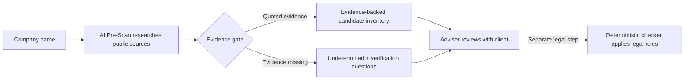

# AI Pre-Scan

**Give it a company name. Get back an evidence-backed first draft of its AI-system inventory — and
the short list of questions you still need to ask.**

Ironhack AI Consulting Bootcamp, Project 3 (Week 6).
**Author:** Nnanyelugo Ahukannah

## Quick start

**Double-click `Run AI Pre-Scan.command`** (macOS) or **`Run AI Pre-Scan.bat`** (Windows).

It sets everything up on first run, starts the tool, and opens your browser. No terminal, no
commands. With no API keys configured it starts in demo mode on sample data and says so on the
page; once keys are present it switches to live research on its own.

Prefer a terminal?

```bash
git clone https://github.com/nyelugo/PROJECT-AI-Pre-Scan.git && cd PROJECT-AI-Pre-Scan
python -m venv .venv && source .venv/bin/activate
pip install -e .
ai-prescan-web --demo          # open http://127.0.0.1:8000
```

Both paths were verified from a clean copy with no virtualenv and no key store present.

## System at a glance



**AI Pre-Scan stops before the legal step.** It finds candidate systems, attaches quoted evidence and
names what still needs human verification. The adviser settles those facts with the client before
passing each verified system to the separate deterministic checker.

See [the detailed architecture](docs/architecture.md) for the research loop, retrieval components,
evidence gate and failure behaviour.

---

## The problem

The EU AI Act is already being phased in. Some obligations apply now, while rules for specified
high-risk use cases apply from **2 December 2027** and rules for AI embedded in regulated products
from **2 August 2028** ([European Commission timeline](https://digital-strategy.ec.europa.eu/en/faqs/navigating-ai-act)).
Companies may have responsibilities as *deployers* — the organisations using AI systems they bought
rather than built.

Working out what applies requires facts about your own operations: which AI systems you run, in what
role, and since when. **Many small companies do not have a reliable inventory.** Marketing bought a
tool on a company card. The applicant tracking system added AI CV ranking in a product update nobody
read.

Every compliance tool available starts after that problem is solved. The
[EU AI Act Compliance Checker](https://artificialintelligenceact.eu/assessment/eu-ai-act-compliance-checker/)
— a free, deterministic questionnaire from the Future of Life Institute — instructs you to *"complete
this form for each individual AI system used in your organisation."* It is per-system, and it assumes
the list already exists.

This project builds the evidence-backed first draft.

## What it produces

**1. The inventory** — one row per candidate AI system, each traceable to a source:

| System | Evidence | Vendor | Built or bought | Where used | First evidenced | Confidence |
|---|---|---|---|---|---|---|
| AI CV ranking in ATS | careers page + vendor changelog | *named* | Bought | Recruitment | June 2026 | Evidenced |
| Support chatbot | product page | *named* | Bought | Customer service | 2024 | Evidenced |

**2. The discussion list** — every question a compliance determination needs that public evidence
cannot settle, phrased so a client can answer it. Run it as a pre-scan, then hand the company a short
list of items to discuss further.

Anything unevidenced comes back **`undetermined`**, never guessed. An agent that always finds
something is an agent that fabricates.

## Who it's for

An external compliance adviser with a client list. She enters a **client's** company name — never her
own — because she has no internal access, and published evidence is what an outside assessor works
from. She gets the inventory, feeds each system into the deterministic checker for the legal step,
and walks into the client meeting already knowing what to ask.

Across a whole client list, it tells her which clients to approach first.

## What it deliberately does not do

**No risk classification. No obligations. No articles. No legal conclusions of any kind.**

It establishes facts; a deterministic tool applies the law. This boundary is the design, not a
disclaimer — and it is why every success metric here is checkable against public evidence rather than
legal judgement.

## How it hands off to the checker

The checker's decision tree was walked end to end (10 August 2026) rather than assumed. Its questions
split cleanly:

- **Facts the agent supplies** — entity type, Annex III domain, EU establishment, exclusions,
  transparency-relevant behaviour, public-body status, GPAI status.
- **Determinations the checker makes** — whether a system is high-risk, Article 6(3) technicalities,
  and whether a practice is prohibited.
- **Undetermined by design** — whether the company rebranded, repurposed or substantially modified a
  bought system. That is invisible from outside and is the highest-stakes question in the tree, since
  any of them turns a deployer into a *provider* under Article 25. It always goes on the discussion
  list.

Two findings from that walkthrough shaped the design: the form is **adaptive by entity type** (a
deployer sees different questions, not just different answers), and it **never asks when a system was
deployed** — so Article 111(2) transition rules sit outside its scope, which is why the inventory
carries a `first evidenced` date.

## Stack

**LangGraph is primary.** The evidence gate is deterministic code that sits *inside* the research
loop and checks both quoted support and source currentness before it emits a finding or sends the
agent back — a state machine, not a pipeline.

**n8n is secondary, and built.** `--notify <webhook-url>` POSTs the finished report to an n8n
webhook as a flat, named payload; n8n creates a page under a parent Notion page. Verified end to end
— Notion's API returned the created page object, which is the evidence, not n8n's success indicator.
Export and setup notes: [`workflows/`](workflows/).

Delivery failure is reported and never fatal: a report produced but not filed is still a report.

APIs: web search, news, company registry, OpenAI, Pinecone.

**Retrieval** does two jobs: a reusable corpus of vendor AI-feature announcements and changelogs
(which answers *did this vendor ship AI into this product, and when* — the question the `first
evidenced` date depends on), and a per-scan evidence store so the evidence gate checks claims against
retrieved passages and source-provenance metadata rather than model memory.

**Every failure degrades toward `undetermined`, never toward a confident claim.** Unavailable sources
are named in the report itself, because a scan that quietly loses a source and reports a clean bill
of health is the worst output this system could produce.

## Status

**Built and measured.** The MVP runs end to end, the 12-company evaluation has been executed, and
two sample reports are generated through the documented run path. Three of six metrics meet target —
see [`eval/results.md`](eval/results.md) for what passes, what misses, and why.

| | |
|---|---|
| Honest refusal rate | **1.0** — nothing invented about companies that publish nothing |
| Thin-band false positives | **0** |
| Provenance violations | **0** across 64 findings |
| Recall | 0.444 against a 0.75 target, and varies run to run |
| Role correctness | 0.739 against 0.90, likewise |
| Over-claim rate | 0.333 against 0.10 — stable, and the outstanding defect |

The three passing metrics held constant across all five evaluation runs. The two failing ones vary
by more between identical runs than between code changes — a limitation of the measurement that is
[written up rather than hidden](eval/results.md).

### Repository map

| Path | What it is |
|---|---|
| `Run AI Pre-Scan.command` · `Run AI Pre-Scan.bat` | Double-click launchers — set up, start, and open the browser |
| [`src/ai_prescan/`](src/ai_prescan/) | The system. `graph.py` (LangGraph), `gate.py` (evidence gate), `schemas.py` (contracts), `tools.py`, `fetch.py`, `extract.py`, `store.py`, `browser.py`, `render.py` |
| [`tests/`](tests/) | Test suite — runs offline, no keys required |
| [`eval/`](eval/) | `run_eval.py`, `make_samples.py`, `migrate_provenance.py`, `ground_truth.json`, `results.md` |
| [`samples/`](samples/) | Two sample reports, generated and unedited |
| [`docs/project-build-plan.md`](docs/project-build-plan.md) | Execution plan, exit gates, deliverable checklist |
| [`docs/proposal.md`](docs/proposal.md) | Full proposal — operator, outputs, checker interface, stack, metrics, ethics, risks |
| [`docs/architecture.md`](docs/architecture.md) | Flow diagram, retrieval design, provenance contract, failure behaviour |
| [`docs/report-spec.md`](docs/report-spec.md) | Output specification and hard rules |
| [`docs/eval-plan.md`](docs/eval-plan.md) | Ground truth, metrics, and the bands that catch over-claiming |
| [`eval/results.md`](eval/results.md) | Measured results against target |
| [`stack_decision.md`](stack_decision.md) | Why LangGraph is primary and n8n secondary |
| [`gtm_future_sprints.md`](gtm_future_sprints.md) | Three post-MVP sprints: goal, buyer, channel, deliverable, metric |
| [`docs/demo-plan.md`](docs/demo-plan.md) · [`docs/elevator-pitch.md`](docs/elevator-pitch.md) | Demo running order and spoken pitch |
| [`docs/system-overview-slide.pptx`](docs/system-overview-slide.pptx) | Editable one-slide overview ([PNG preview](docs/system-overview-slide.png)) |
| [`docs/scaling-and-durability.md`](docs/scaling-and-durability.md) | Covering other AI regimes, and what keeps the tool from going stale |
| [`docs/talking-points.md`](docs/talking-points.md) | One-page version for a reviewer conversation |

## Demo

**5–7 minutes, covering autonomy, report output, stack rationale and the GTM sprints.**
Running order and the exact commands: [`docs/demo-plan.md`](docs/demo-plan.md).

> **Recording:** _(link to be added — or delete this line if presented live)_

## Setup and run

```bash
python -m venv .venv && source .venv/bin/activate     # Python 3.12
pip install -e .                                       # installs the package and its dependencies
playwright install chromium                            # fallback for hosts that block scripted fetches
```

`pip install -e .` matters: the package lives under `src/`, so without installing it every documented
command fails with `No module named ai_prescan`. `pip install -r requirements.txt` still works if you
prefer, but then you must prefix commands with `PYTHONPATH=src`.

### See it working with no API keys

```bash
ai-prescan-web --demo        # http://127.0.0.1:8000
```

Runs the whole interface on fixed sample data — no keys, no network, nothing to configure. The page
says so, so demo output cannot be mistaken for a real scan. This is the fastest way to see what the
tool does after cloning.

### The interface

```bash
ai-prescan-web                              # http://127.0.0.1:8000
ai-prescan-web --notify <n8n-webhook>       # also file each report into Notion
ai-prescan-web --demo                       # sample data, no keys needed
```

Built around the adviser's job rather than the pipeline.

**The client book is the home screen** — and the card order follows what she needs. An empty book
puts *Add your clients* first, because a new user should meet the thing they need rather than an
accordion under an empty table. Once there is a book, the list she came to read is first.

**Filters, not scrolling.** All · Never scanned · Due a re-scan · Website unconfirmed, each with a
count. At forty clients the useful question is "show me the never-scanned", not "let me scroll".

**Every row has its own Scan button**, so answering one client's question does not mean ticking a box
and travelling to a toolbar. Selecting several shows what it costs — *"Scan 2 selected · about 5
minutes, running one at a time"* — and **Scan every client** asks for confirmation with the count and
the time, because on forty clients one click is a two-hour commitment.

**Reports print.** She hands them to clients, so the print stylesheet drops the navigation, the
buttons and the forms and keeps the report.

 Add a client once — name, website, notes — and never type
them again. Import a whole list in one paste. The book is ordered by *who needs attention*, not
alphabetically: never scanned first, then overdue, then most unresolved findings. That ordering is
the product's actual job — an adviser with forty clients needs to know who to look at first, and
that question cannot be asked of a text box.

- **Never scanned is called out in red**, because an unknown client is a bigger risk to an adviser
  than a known one with findings.
- **Scans go stale.** After 30 days a client is flagged as due a re-scan; a scan is a snapshot, and
  saying so is more honest than showing an old number as if it were current.
- **Tick one, several, or scan the whole book.** One client opens its scan and waits with you; a
  batch queues and you come back.
- **Each client has a page** with its full scan history, so re-scanning shows change over time —
  which is how a vendor quietly adding AI to a tool the client already had gets caught. The client
  changed nothing, so nobody there is watching.
- **A prospect can be scanned once** without joining the book.
- **The website is optional to type, never optional to have.** It is the strongest control in the
  pipeline — a page on the client's own site is about that client by construction. Type it and it is
  taken as confirmed. Leave it blank and a background resolver proposes one, marked **unconfirmed**
  until Maria agrees, with a one-click *"that's right"* in the book. If none can be found the client
  is flagged in red. The book's summary counts how many identities are unsettled. A missing website
  is never silent, because a report about the wrong company reads exactly like a right one.

The report itself puts the **questions to ask first**, then the evidence: tables as tables, quotes
as quotes, a Markdown download to hand over, and a plain statement of what the scan could not see.
Failures are phrased for a person, not as tracebacks.

**What it is not.** It runs on localhost with no accounts and no authentication. Making it something
Maria can open from her own office is a deployment step and belongs to
[GTM sprint 1](gtm_future_sprints.md), not to this build.

### Run a scan from the command line


```bash
ai-prescan "Fitzgerald Recruitment Ltd"                # fixtures: no network, no keys
ai-prescan "Personio" --live --out report.md           # live research
```

### Tests and evaluation

```bash
pip install -e '.[dev]' && pytest    # 51 tests, offline, no keys
python eval/run_eval.py --dry       # what would be scanned, and the cost
python eval/run_eval.py             # the 12-company evaluation (~$2 of OpenAI)
python eval/make_samples.py         # regenerate both sample reports
python eval/migrate_provenance.py   # re-fetch and re-hash every ground-truth source
```

`run_eval.py` writes `eval/results.md`, `eval/results.json` and a per-company report to
`eval/reports/`. The reports are what make a bad number diagnosable — the first run's recall of 0.000
turned out to be a broken matcher, and finding that out required re-scanning by hand because the
runner had discarded them.

### Tools and APIs

Five external services plus two keyless ones. Any tool without a key becomes a **named unavailable
source in the report** rather than a silent gap.

| Tool | What it does | Key |
|---|---|---|
| **Serper** (Google Search) | Finds the company's public footprint; queries are scoped to its own domain when known | `SERPER_API_KEY` |
| **NewsAPI** | Vendor announcements and deployment coverage — where dates live | `NEWS_API_KEY` |
| **OpenAI** | Evidence extraction (`gpt-4o`) and embeddings (`text-embedding-3-small`, 1536) | `OPENAI_API_KEY` |
| **Pinecone** | Per-scan evidence store and the vendor AI-feature corpus | `PINECONE_API_KEY` |
| **Notion** (via n8n) | Files the finished report where the adviser works | n8n credential |
| **GLEIF** | Legal identity for registered entities | none — keyless |
| **Wikidata** | Official website lookup | none — keyless |

### Keys

Read from the shared store at `~/.config/ironhack/.env.local`. **No keys live in this repo**, none
are written to `.env.example`, docs, or commits, and presence is verified by length and hash
fingerprint rather than by printing a value.

| Variable | Used for | Required |
|---|---|---|
| `OPENAI_API_KEY` | Evidence extraction and embeddings | yes, for `--live` |
| `PINECONE_API_KEY` | Evidence store and vendor corpus | yes, for `--live` |
| `SERPER_API_KEY` | Web search | strongly recommended |
| `NEWS_API_KEY` | Vendor announcements and dates | optional |

GLEIF and Wikidata need no key. Any tool without a key becomes a **named unavailable source in the
report** rather than a silent gap.

## Credits and scope

The [EU AI Act Compliance Checker](https://artificialintelligenceact.eu/assessment/eu-ai-act-compliance-checker/)
is built and maintained by the **Future of Life Institute**, which states it is not affiliated with
the European Union. This project feeds that tool; it does not reimplement or replace it.

Research targets are publicly listed or clearly public-facing companies, using published sources
only. The subject of research is the **organisation**, not any individual. Output carries no legal
determination and is intended for human review.
