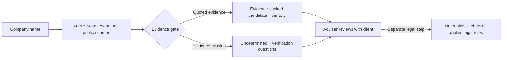

# AI Pre-Scan

**Give it a company name. Get back an evidence-backed first draft of its AI-system inventory — and
the short list of questions you still need to ask.**

Ironhack AI Consulting Bootcamp, Project 3 (Week 6).
**Author:** Nnanyelugo Ahukannah

## System at a glance



**AI Pre-Scan stops before the legal step.** It finds candidate systems, attaches quoted evidence and
names what still needs human verification. The adviser settles those facts with the client before
passing each verified system to the separate deterministic checker.

See [the detailed architecture](docs/architecture.md) for the research loop, retrieval components,
evidence gate and failure behaviour.

---

## The problem

The EU AI Act is already being phased in. Some obligations apply now, while rules for specified
high-risk use cases apply from **2 December 2027** and rules for AI embedded in regulated products
from **2 August 2028** ([European Commission timeline](https://digital-strategy.ec.europa.eu/en/faqs/navigating-ai-act)).
Companies may have responsibilities as *deployers* — the organisations using AI systems they bought
rather than built.

Working out what applies requires facts about your own operations: which AI systems you run, in what
role, and since when. **Many small companies do not have a reliable inventory.** Marketing bought a
tool on a company card. The applicant tracking system added AI CV ranking in a product update nobody
read.

Every compliance tool available starts after that problem is solved. The
[EU AI Act Compliance Checker](https://artificialintelligenceact.eu/assessment/eu-ai-act-compliance-checker/)
— a free, deterministic questionnaire from the Future of Life Institute — instructs you to *"complete
this form for each individual AI system used in your organisation."* It is per-system, and it assumes
the list already exists.

This project builds the evidence-backed first draft.

## What it produces

**1. The inventory** — one row per candidate AI system, each traceable to a source:

| System | Evidence | Vendor | Built or bought | Where used | First evidenced | Confidence |
|---|---|---|---|---|---|---|
| AI CV ranking in ATS | careers page + vendor changelog | *named* | Bought | Recruitment | June 2026 | Evidenced |
| Support chatbot | product page | *named* | Bought | Customer service | 2024 | Evidenced |

**2. The discussion list** — every question a compliance determination needs that public evidence
cannot settle, phrased so a client can answer it. Run it as a pre-scan, then hand the company a short
list of items to discuss further.

Anything unevidenced comes back **`undetermined`**, never guessed. An agent that always finds
something is an agent that fabricates.

## Who it's for

An external compliance adviser with a client list. She enters a **client's** company name — never her
own — because she has no internal access, and published evidence is what an outside assessor works
from. She gets the inventory, feeds each system into the deterministic checker for the legal step,
and walks into the client meeting already knowing what to ask.

Across a whole client list, it tells her which clients to approach first.

## What it deliberately does not do

**No risk classification. No obligations. No articles. No legal conclusions of any kind.**

It establishes facts; a deterministic tool applies the law. This boundary is the design, not a
disclaimer — and it is why every success metric here is checkable against public evidence rather than
legal judgement.

## How it hands off to the checker

The checker's decision tree was walked end to end (10 August 2026) rather than assumed. Its questions
split cleanly:

- **Facts the agent supplies** — entity type, Annex III domain, EU establishment, exclusions,
  transparency-relevant behaviour, public-body status, GPAI status.
- **Determinations the checker makes** — whether a system is high-risk, Article 6(3) technicalities,
  and whether a practice is prohibited.
- **Undetermined by design** — whether the company rebranded, repurposed or substantially modified a
  bought system. That is invisible from outside and is the highest-stakes question in the tree, since
  any of them turns a deployer into a *provider* under Article 25. It always goes on the discussion
  list.

Two findings from that walkthrough shaped the design: the form is **adaptive by entity type** (a
deployer sees different questions, not just different answers), and it **never asks when a system was
deployed** — so Article 111(2) transition rules sit outside its scope, which is why the inventory
carries a `first evidenced` date.

## Stack

**LangGraph is primary.** The evidence gate is deterministic code that sits *inside* the research
loop and checks both quoted support and source currentness before it emits a finding or sends the
agent back — a state machine, not a pipeline.

**n8n is secondary**, for the trigger, scheduled sweeps across a client list, and delivering finished
inventories into Notion or Airtable.

APIs: web search, news, company registry, OpenAI, Pinecone.

**Retrieval** does two jobs: a reusable corpus of vendor AI-feature announcements and changelogs
(which answers *did this vendor ship AI into this product, and when* — the question the `first
evidenced` date depends on), and a per-scan evidence store so the evidence gate checks claims against
retrieved passages and source-provenance metadata rather than model memory.

**Every failure degrades toward `undetermined`, never toward a confident claim.** Unavailable sources
are named in the report itself, because a scan that quietly loses a source and reports a clean bill
of health is the worst output this system could produce.

## Status

**Proposal approved; build begins Week 6.** This repository currently holds the planning artefacts.

| Document | What it is |
|---|---|
| [`docs/project-build-plan.md`](docs/project-build-plan.md) | Dependency-driven Week 6 execution plan, exit gates and deliverable checklist |
| [`docs/proposal.md`](docs/proposal.md) | Full proposal — operator, outputs, checker interface, stack, metrics, ethics, GTM sprints, risks |
| [`docs/talking-points.md`](docs/talking-points.md) | One-page version: what, why, how, and the questions a reviewer will ask |
| [`docs/architecture.md`](docs/architecture.md) | Flow diagram, where retrieval earns its place, failure behaviour, tool validation |
| [`docs/report-spec.md`](docs/report-spec.md) | What the system produces — sections, what "good" means, hard rules |
| [`gtm_future_sprints.md`](gtm_future_sprints.md) | Three post-MVP sprints: goal, buyer, channel, deliverable, metric |
| [`docs/eval-plan.md`](docs/eval-plan.md) | How the claims get measured — ground truth, metrics, and the bands that catch over-claiming |
| [`eval/ground_truth.json`](eval/ground_truth.json) | Verified ground truth, each entry citing a page published by the company or its vendor |
| [`docs/demo-plan.md`](docs/demo-plan.md) | 5–7 minute demo running order |
| [`docs/elevator-pitch.md`](docs/elevator-pitch.md) | Short spoken pitch, about 90–100 seconds, with delivery notes |
| [`docs/system-overview-slide.pptx`](docs/system-overview-slide.pptx) | Editable one-slide system overview, with an inline [`PNG preview`](docs/system-overview-slide.png) for the elevator pitch |
| [`docs/scaling-and-durability.md`](docs/scaling-and-durability.md) | Design intent: covering other AI regimes, and what keeps the tool from going stale |

## Setup and run

```bash
python -m venv .venv && source .venv/bin/activate     # Python 3.12
pip install -r requirements.txt

PYTHONPATH=src python -m ai_prescan "Fitzgerald Recruitment Ltd"   # fixture run: no network, no keys
pytest                                                            # 20 tests
```

Phase 1 runs entirely on controlled fixtures, so the smoke path is deterministic and needs no
credentials. Live research arrives in Phase 2 (`--live`).

Keys are read from the shared Ironhack key store at `~/.config/ironhack/.env.local` —
`OPENAI_API_KEY`, `PINECONE_API_KEY`, plus search and news keys. **No keys live in this repo**, and
none are written to `.env.example`, docs, or commits.

## Credits and scope

The [EU AI Act Compliance Checker](https://artificialintelligenceact.eu/assessment/eu-ai-act-compliance-checker/)
is built and maintained by the **Future of Life Institute**, which states it is not affiliated with
the European Union. This project feeds that tool; it does not reimplement or replace it.

Research targets are publicly listed or clearly public-facing companies, using published sources
only. The subject of research is the **organisation**, not any individual. Output carries no legal
determination and is intended for human review.
