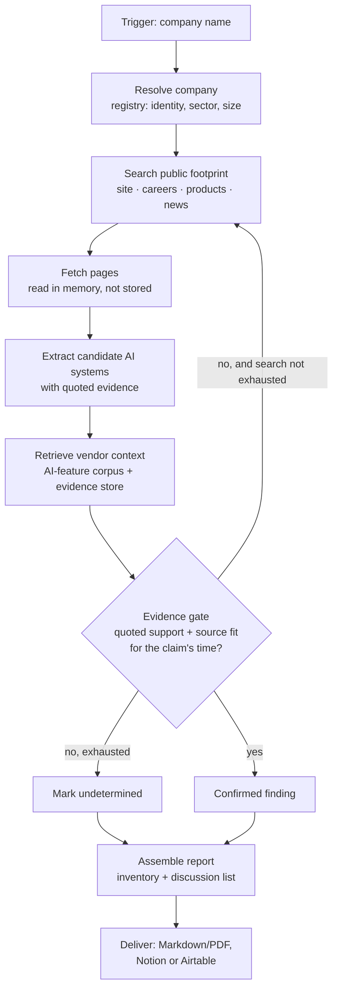

# Architecture

Happy path, plus the two decisions that shape it: where retrieval earns its place, and what happens
when a tool fails.

---

## The flow

**LangGraph owns A–J.** The gate at **G** is the reason: deterministic code must check both quoted
support and source currentness *inside* the loop, where it can redirect the agent rather than merely
observe a failure.

**K is n8n, and it is built.** The CLI posts the finished report to an n8n webhook, which files it
as a page in Notion (`workflows/n8n_report_delivery.json`). Verified against Notion's API response
rather than n8n's success indicator. Scheduled sweeps across a client list remain design intent.

**Autonomy boundary:** everything after A runs without intervention. The only human input is the
company name.

---

## Where RAG earns its place

The narrowing removed the EU AI Act corpus — the system no longer cites articles, so the Act is no
longer retrieved. Retrieval still does two jobs, and both are load-bearing rather than decorative.

### 1. The vendor AI-feature corpus — **designed, not built**

**Nothing ingests this corpus today.** `store.VENDOR_NAMESPACE` exists and has no writer and no
reader. What follows is the design and the reason for it, not a description of running code.

The intent: a small curated corpus of **vendor announcements, changelogs, release notes and product
pages** for the SaaS tools SMEs actually run — applicant tracking, CRM, helpdesk, marketing
automation.

It answers the question the inventory depends on and public search answers badly:

> *Did this vendor ship AI into this product, and when?*

Why retrieval rather than a live search per company:

- **It is reusable.** One corpus serves every company scanned. The 400th scan is cheaper and better
  grounded than the first, because the corpus has grown.
- **It carries dates.** `first evidenced` needs the vendor's announcement date, not the date we
  happened to search — and the AI Act's transition rules turn on when a system arrived.
- **It is the delta engine.** Sprint 2's vendor-drift alert is a diff over this corpus. Without it,
  detecting that a vendor shipped AI in June is guesswork.

### Corpus currentness — a warning learned the hard way

**Vendor and legal sources go stale, and they do not announce it.**

On 10 August 2026 the local copy of the AI Act — the original Regulation text — was read to confirm
that high-risk obligations applied from 2 August 2026. Article 113 says exactly that. It is also
out of date: the **Digital Omnibus** moved high-risk obligations to **2 December 2027** and
embedded-product rules to **2 August 2028** because standards and other implementation support —
including guidance, common specifications, national authorities and conformity-assessment
frameworks — were delayed
([Regulation (EU) 2026/1744](https://eur-lex.europa.eu/legal-content/EN/ALL/?uri=CELEX%3A32026R1744)).
A confident, sourced, wrong answer — produced by verifying against a stale corpus.

The Teamtailor vendor page in the corpus repeats the same superseded date ("August 2026: High-risk
AI rules take effect").

#### Source-provenance contract

**A retrieval timestamp proves when a document was fetched; it does not prove that the document was
current then.** Every vendor-corpus and per-scan source must therefore carry:

| Field | Purpose |
|---|---|
| `canonical_url` | Stable source identity after redirects |
| `retrieved_at` | When this exact copy was fetched |
| `source_published_at` / `source_updated_at` | The source's own version dates, or `null` with a reason |
| `content_sha256` | Detects silent changes to the document |
| `authority_class` | Company, vendor, registry, news, or other |
| `currentness_checked_at` | When the canonical source and supersession path were last checked |
| `currentness_status` | `current`, `superseded`, or `unknown` |
| `superseded_by` | Replacement source when one exists |
| `next_review_at` | Refresh deadline derived from source class |

**What counts as a currency signal.** A 200 response does not; the superseded AI Act text returns
200 today. Two things do:

1. **A publication date inside the review window** for that class of source.
2. **The page being on the company's own domain.** A live page where the company describes its own
   product in the present tense is an assertion by the company about itself — the publisher is the
   subject, which is a stronger signal than a date on somebody else's page.

Third-party pages need the date. Requiring one everywhere was the opposite error: a scan of Personio
returned four findings, all `undetermined`, because the company's own product pages carry no dates.
Honest, and useless.

The deterministic evidence gate applies the metadata differently by claim type:

1. **Historical event:** a dated, hashed source may still prove that a vendor announced a feature at
   that time, even if the page was later superseded.
2. **Current state:** the source must be marked `current` and checked within its review window.
3. **Unknown or overdue:** the claim becomes `undetermined`; the agent searches for a current source
   rather than treating a fresh retrieval as proof of freshness.
4. **Changed content:** a new hash invalidates dependent findings. **Implemented in the gate and
   not yet wired** — no prior hashes are persisted, so `known_hashes` is never supplied outside the
   tests, and this rule does not fire in a live scan.

The AI Act is not part of the runtime corpus because this system makes no legal claims. When project
documentation verifies a legal timeline, an original or local copy is never sufficient by itself;
the check must use current official consolidated or amending material.

### 2. The per-company evidence store — **validated passages only, written, not yet read**

**Validated evidence passages are upserted per company — not pages.** `assemble` stores one vector
per passage that survived the gate, carrying the same text that ships in the report. `research`
persists nothing: a fetched page is read in memory and discarded.

It used to store whole pages, and that was wrong on two counts. Pages carry names, titles and quoted
third parties who are not the subject of the research, and nothing ever read them back — data
collected and never used is the least justifiable kind. `store.purge_scan` runs before every live
scan, so what is stored never outlives the latest scan of that company, and `store.delete_namespace`
gives the deletion path the store previously lacked entirely.

**`store.query` still has no caller.** Quote verification is done by `extract._quote_is_in_page`, a
normalised substring check against the page text held in memory, and the gate inspects only the
provenance attached to each finding — both would behave identically with Pinecone removed.

So the store is real and populated, and it is not currently what makes the rules enforceable.
Saying otherwise would be describing a design as a system, which is the failure this project's
whole architecture is arranged against.

Same embedding model and dimension on both sides — `text-embedding-3-small`, 1536 — carried over from
Week 5, where a mismatch would have failed silently on the read side.

---

## Failure behaviour

The MVP must run unattended after the trigger, so every external call has a defined failure mode.
None of them may produce a confident report.

| Failure | Behaviour |
|---|---|
| Search API rate-limited | Exponential backoff with jitter, 3 attempts |
| Search API down after retries | Remaining queries are abandoned; the scan continues on what it has and the source is named as unavailable |
| Page fetch fails / 404 | Source dropped; any claim depending on it falls to `undetermined` |
| Registry lookup fails | Scan proceeds; identity fields marked unverified |
| LLM returns malformed extraction | Schema validation rejects it and the candidate is dropped rather than guessed (no retry) |
| Zero systems found | **A valid outcome.** Report says so, with sources consulted — not an error |

**The rule underneath all of it:** every failure degrades toward `undetermined`, never toward a
confident claim. A scan that silently loses a source and reports a clean bill of health is the worst
output this system can produce — which is why unavailable sources are named in the report itself.

---

## Tools

| Tool | Role | Validation |
|---|---|---|
| Web search (Serper) | Locate the public footprint | Non-200 named as an unavailable source |
| News API | Vendor announcements, deployments | Non-200 named as an unavailable source |
| Identity: GLEIF + Wikidata + Serper KG | Legal identity and the company's own domain | Registry name must match the query once corporate suffixes are stripped; identity counts as resolved only when a domain is found |
| OpenAI | Evidence extraction, embeddings | Structured-output schema validation |
| Pinecone | Vendor corpus + evidence store | Dimension asserted on write and read |
