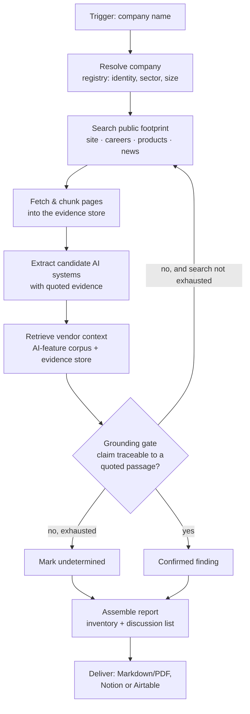

# Architecture

Happy path, plus the two decisions that shape it: where retrieval earns its place, and what happens
when a tool fails.

---

## The flow

**LangGraph owns A–J.** The gate at **G** is the reason: it is deterministic code that must sit
*inside* the loop and redirect the agent, not observe it from outside. n8n owns the trigger and **K**,
plus scheduled sweeps across a client list.

**Autonomy boundary:** everything after A runs without intervention. The only human input is the
company name.

---

## Where RAG earns its place

The narrowing removed the EU AI Act corpus — the system no longer cites articles, so the Act is no
longer retrieved. Retrieval still does two jobs, and both are load-bearing rather than decorative.

### 1. The vendor AI-feature corpus *(the substantive one)*

A small curated corpus of **vendor announcements, changelogs, release notes and product pages** for
the SaaS tools SMEs actually run — applicant tracking, CRM, helpdesk, marketing automation.

It answers the question the inventory depends on and public search answers badly:

> *Did this vendor ship AI into this product, and when?*

Why retrieval rather than a live search per company:

- **It is reusable.** One corpus serves every company scanned. The 400th scan is cheaper and better
  grounded than the first, because the corpus has grown.
- **It carries dates.** `first evidenced` needs the vendor's announcement date, not the date we
  happened to search — and the AI Act's transition rules turn on when a system arrived.
- **It is the delta engine.** Sprint 2's vendor-drift alert is a diff over this corpus. Without it,
  detecting that a vendor shipped AI in June is guesswork.

### 2. The per-company evidence store *(the grounding one)*

Pages fetched during a scan are chunked and embedded so the grounding gate checks claims against
**retrieved passages** rather than model memory. This is what makes "no claim without a quoted
passage" enforceable instead of aspirational.

Same embedding model and dimension on both sides — `text-embedding-3-small`, 1536 — carried over from
Week 5, where a mismatch would have failed silently on the read side.

---

## Failure behaviour

The MVP must run unattended after the trigger, so every external call has a defined failure mode.
None of them may produce a confident report.

| Failure | Behaviour |
|---|---|
| Search API rate-limited | Exponential backoff with jitter, 3 attempts |
| Search API down after retries | Circuit breaker opens; scan continues on remaining sources, and the report's *method* section records the source as unavailable |
| Page fetch fails / 404 | Source dropped; any claim depending on it falls to `undetermined` |
| Registry lookup fails | Scan proceeds; identity fields marked unverified |
| LLM returns malformed extraction | Schema validation rejects it; one retry, then the candidate is dropped rather than guessed |
| Zero systems found | **A valid outcome.** Report says so, with sources consulted — not an error |

**The rule underneath all of it:** every failure degrades toward `undetermined`, never toward a
confident claim. A scan that silently loses a source and reports a clean bill of health is the worst
output this system can produce — which is why unavailable sources are named in the report itself.

---

## Tools

| Tool | Role | Validation |
|---|---|---|
| Web search (Serper) | Locate the public footprint | Result count and domain sanity check |
| News API | Vendor announcements, deployments | Date range enforced |
| Company registry | Identity, sector, size | Match confirmed against name and jurisdiction |
| OpenAI | Evidence extraction, embeddings | Structured-output schema validation |
| Pinecone | Vendor corpus + evidence store | Dimension asserted on write and read |
