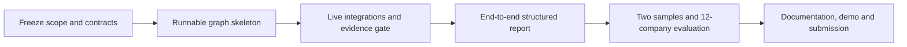

# Project Build Plan

This is the canonical execution plan for the Week 6 build of **AI Pre-Scan**. The Day 1–4 goals
reported to the cohort are reporting buckets, not fixed time boxes. Implementation should advance as
soon as a phase's exit gate passes; phases may compress or overlap when their dependencies allow it.
There is no reason to stretch completed work to fill a day.

## Outcome and scope

The build is complete when an adviser can enter a company name and receive a structured,
evidence-backed first draft of its AI-system inventory plus a discussion list for facts that public
research cannot establish. The system stops before legal classification and degrades to
`undetermined` whenever evidence is missing, stale or unsupported.

The detailed specifications remain authoritative:

- [Architecture](architecture.md) — research loop, retrieval, evidence gate and failure behaviour
- [Report specification](report-spec.md) — output schema and hard rules
- [Evaluation plan](eval-plan.md) — 12-company ground truth, metrics and acceptance bands
- [Demo plan](demo-plan.md) — 5–7 minute presentation flow
- [GTM future sprints](../gtm_future_sprints.md) — post-MVP commercial experiments

## Current state

| Deliverable | State |
|---|---|
| Elevator pitch | Complete |
| Stack decision — LangGraph primary, n8n secondary | Complete |
| GTM future sprints | Complete |
| Working MVP | Phase 2 — live research path runs end to end (`--live`): tools, fetch with provenance, extraction with quote + subject verification, dedup |
| Three or more live integrations | Live and keyed: Serper, NewsAPI, OpenAI, Pinecone. Keyless: GLEIF and Wikidata for identity. OpenCorporates dropped — not free |
| Two sample reports | Not yet generated |
| Evaluation run | Provenance migration complete (11/12 hashed); preflight blocks 1 entry pending the browser-backed fetcher |
| Demo | Plan complete; delivery pending |

## Critical path

Work can run in parallel around this path — for example, documentation can be updated while
integrations are built — but no downstream phase is accepted before its required inputs exist.

## Phase 1 — Foundation

**Reported under Day 1**

- Confirm the required deliverables and freeze MVP scope.
- Scaffold a runnable LangGraph entry point and shared state.
- Define the report and source-provenance schemas.
- Implement configuration that reads the shared Ironhack key store without copying secrets into the
  repository.
- Add baseline schema, state-transition and smoke tests.

**Exit gate:** one deterministic smoke run reaches a schema-valid structured report using controlled
fixtures, and every emitted finding carries the required provenance fields.

## Phase 2 — Core build

**Reported under Day 2**

- Integrate at least three live research tools: web search, news or vendor research, and a company
  registry.
- Add a browser-backed fetch fallback for bot-blocked hosts (`whoop.com` returns 403 to scripted
  fetches), with unreachable hosts degrading to `undetermined` and named in the report.
- Add OpenAI extraction and the Pinecone evidence store.
- Implement the deterministic quoted-evidence and source-currentness gate inside the graph.
- Add bounded retries, explicit unavailable-source reporting and `undetermined` paths.

**Exit gate:** a company-name trigger invokes at least three live tools, produces schema-valid output,
blocks unsupported current-state claims and names degraded or unavailable sources.

## Phase 3 — End-to-end proof

**Reported under Day 3**

- Run the full graph from company trigger to structured report.
- Generate and retain two sample reports: one evidence-rich company and one thin-footprint company.
- Execute the 12-company evaluation and the provenance preflight defined in the evaluation plan.
- Fix false positives, unsupported claims and critical failure paths exposed by the evaluation.

**Exit gate:** both sample reports are reproducible, evaluation metrics are recorded, every
current-state claim is cited, and no critical error path silently becomes a confident finding.

## Phase 4 — Delivery

**Reported under Day 4**

- Complete setup, run, file-map, architecture, environment and API documentation.
- Recheck the GTM sprint artefact against the required format.
- Prepare and rehearse the 5–7 minute demo using the retained sample outputs.
- Run tests, link checks and a repository secret scan.
- Commit and push the final repository, then submit its GitHub URL.

**Exit gate:** every official deliverable below is present in the public repository, the documented
run path works from a clean setup, and the demo can be delivered without relying on untracked files.

## Official deliverable checklist

- [ ] Working MVP accepts a company trigger and produces the specified report.
- [x] Stack decision is documented: LangGraph primary, n8n secondary.
- [x] Three GTM future sprints are documented.
- [ ] At least three APIs or external tools are integrated and demonstrated.
- [ ] Two contrasting sample reports are tracked in the repository.
- [ ] The 12-company evaluation and provenance preflight pass their stated acceptance criteria.
- [ ] Setup, run, architecture, environment and file-map documentation match the implementation.
- [ ] A 5–7 minute live or recorded demo is ready.
- [ ] Tests, link checks and the secret scan pass before submission.
- [ ] Final commit is pushed and the GitHub URL is submitted.

## Execution rules

1. **Outcome-gated, not day-gated.** Start the next ready phase immediately when the current exit
   gate passes.
2. **Protect the critical path.** Build the smallest runnable vertical slice before adding breadth.
3. **Evidence before confidence.** Missing support always becomes `undetermined`, never a plausible
   completion.
4. **Keep artefacts reproducible.** Sample reports and evaluation results must be generated through
   the documented run path, not edited into shape by hand.
5. **Keep the public repository clean.** Keys remain only in `~/.config/ironhack/.env.local`; no
   secret values, local environments or generated caches are committed.
